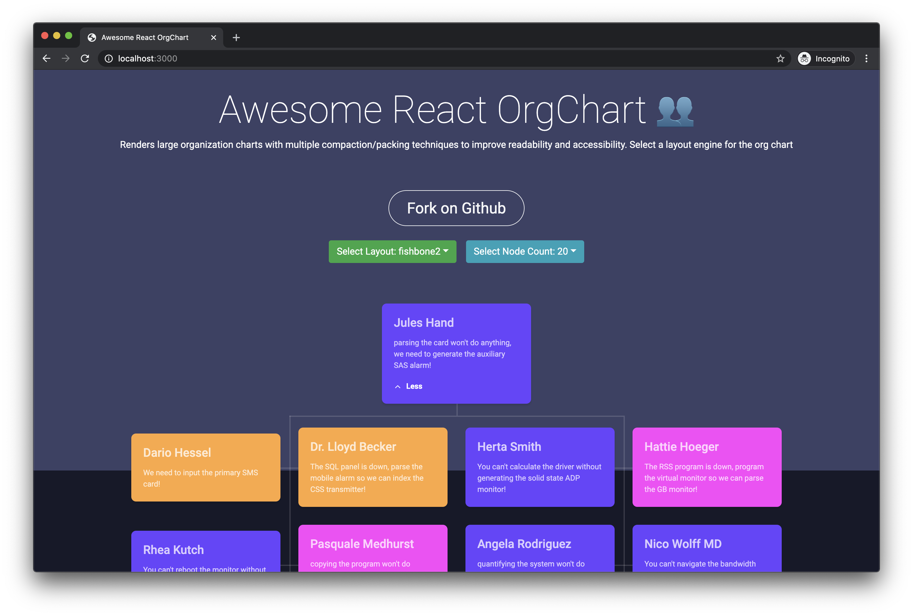

# Awesome React Org Chart 👥

[](https://badge.fury.io/js/awesome-react-org-chart)

Supports large organization charts with multiple compaction/packing techniques to improve readability and accessibility.

## [Example](https://mathew-kurian.github.io/awesome-react-org-chart/)



```tsx
import OrgChart from "awesome-react-org-chart";

// `Card` class is used for demo purposes

<OrgChart
  root={nodes[0]}
  keyGetter={(node) => String(node.id)}
  childNodesGetter={(node) =>
    node.children.map((id: string | number) =>
      nodes.find((node) => node.id === id)
    )
  }
  layout={layout}
  connectorHorizontalStyle={{ borderTop: "1px solid red" }}
  connectorVerticalStyle={{ borderLeft: "1px solid red" }}
  sizeGetter={(node, domElement) => domElement.getBoundingClientRect()}
  containerStyle={{ margin: "0 auto" }}
  renderNode={(node) => (
    <Card style={{ width: "18rem" }}>
      <Card.Body>
        <Card.Title>ID #{node.name}</Card.Title>
        <Card.Text>
          Some quick example text to build on the card title and make up the
          bulk of the card's content.
        </Card.Text>
      </Card.Body>
    </Card>
  )}
/>;
```

## Animation

The OrgChart uses `transform3d` to position items on the screen. CSS transitions along with some React/JavaScript can be used to make animations.


## No React? [Example!](https://mathew-kurian.github.io/awesome-react-org-chart/public/vanilla.html)

The OrgChart does not need to use React. Please refer to the `VanillaExample.ts` file in the repo to learn more.

## Credits

[OrgChart](https://github.com/romanpolunin/OrgChart) by [@romanpolunin](https://github.com/romanpolunin)
